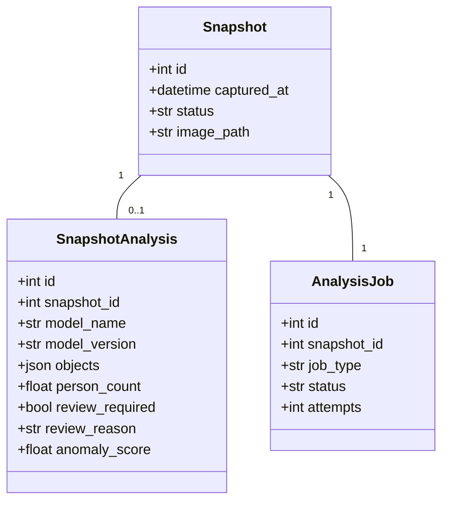
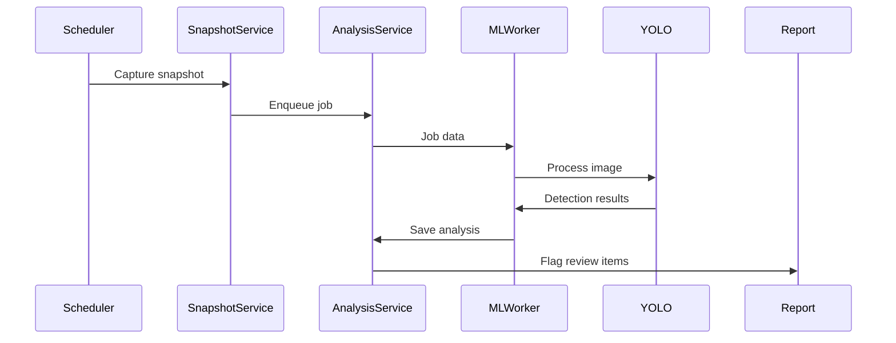

# ML Integration Plan

## Goal
Integrate local ML models (YOLO primary, Anomalib secondary) to analyze snapshots and flag unusual objects/persons for human review.

## Key Constraints
- Local-only inference (no cloud dependencies)
- Maintain existing FastAPI/APScheduler architecture
- Prefer rule-based "unusual" definitions
- Prioritize YOLO implementation first

## Target Architecture
```
[Camera Monitor Web] → [Database Queue] ← [ML Worker]
      ↑                      |
    (Capture)           (Analysis Results)
      |                      ↓
[Snapshot Storage]  [Human Review UI]
```

### Services
1. **camera-monitor-web**: Existing FastAPI app (capture + reporting)
2. **ml-worker**: New GPU-enabled service for inference
   - Shares `/app/data` volume and SQLite DB
   - Based on Debian/CUDA image

## Implementation Phases

### Phase 1: Data Model & Infrastructure (Week 1)


**Key Files**:
- `app/sql/schema.sql`: Add new tables
- `app/domain/models.py`: Add ORM mappings
- `app/core/database.py`: Update schema helpers

### Phase 2: YOLO Integration (Week 2-3)


**Implementation**:
- Add `app/infrastructure/ml/yolo.py`
- Create `app/application/services/analysis_service.py`
- Modify `snapshot_service.py` to enqueue jobs after capture

### Phase 3: Human Review Workflow (Week 4)

**Components**:
1. API endpoints in `report.py`:
   - `GET /api/review/pending`
   - `POST /api/review/{analysis_id}/confirm`
   - `POST /api/review/{analysis_id}/reject`
2. UI updates in `index.html`:
   - Badges for review items
   - Filterable review queue
3. Dashboard integration via `manifest.json`:
   ```json
   {
     "cameras": [
       {
         "id": 1,
         "name": "Entrance",
         "pending_reviews": 3, 
         "last_alert": "Person detected after hours"
       }
     ]
   }
   ```

### Phase 4: Anomalib Integration (After 1-2 weeks of YOLO operation)

**Calibration Requirements**:
- Collect 5000+ "normal" images per camera
- Manually label 200+ anomaly samples
- Per-camera model training

**Implementation Path**:
1. Create `app/infrastructure/ml/anomaly.py`
2. Add training scripts in `scripts/train_anomaly.py`
3. Extend `analysis_service.py` to handle Anomalib jobs
4. Add `anomaly_score` to review prioritization

### Phase 5: Training Pipeline (Ongoing)
```
data/
├── models/
│   ├── yolo/
│   │   ├── v1/ 
│   │   └── v2/
│   └── anomalib/
│       ├── entrance_camera/
│       └── parking_camera/
└── exports/
    ├── for_labeling/
    └── reviewed/
```
**Tools**: CVAT for labeling, PyTorch-Lightning for training.

---

## Deployment Considerations
1. **Docker Changes**:
   ```Dockerfile
   # ML worker Dockerfile
   FROM nvcr.io/nvidia/pytorch:23.10-py3
   COPY --from=base-image /app /app
   RUN pip install anomalib ultralytics
   CMD ["python", "ml_worker.py"]
   ```
2. **Resource Monitoring**:
   - GPU memory usage
   - Inference latency
   - Queue depth alerts

## Testing Plan
1. Unit tests: Rule engine, service logic
2. Integration tests: Sample snapshots with known objects
3. Load tests: Simulate production snapshot volume

## Risk Mitigation
| Risk | Mitigation Strategy |
|------|---------------------|
| GPU dependencies | CPU fallback mode |
| False positives | Rule calibration dashboard |
| Model drift | Quarterly retraining cycle |
| Storage growth | Retention policies for analysis data |

## Initial Rollout Sequence
1. Shadow mode (YOLO analyzes without flagging)
2. Enable review flags for QA group
3. Organization-wide rollout
4. Anomalib phased introduction

**Maintainer**: @lmex89
**Version**: 1.0